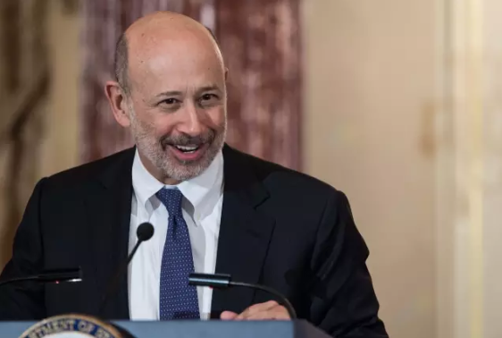
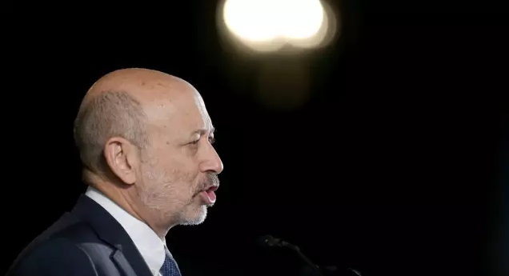

# The Ambition

不要自我设限，和有野心的人为伍，做一个全面的人。给大家分享这一走心、有深度的演讲。

劳尔德·贝兰克梵（Lloyd Blankfein），世界上最大的投资银行高盛集团CEO，贝兰克梵因带领高盛集团成功走出2008年金融危机而为人所熟知。贝兰克梵1954年出生于纽约布鲁克林的一个贫民区，父亲是一个普通的邮件分拣员。他曾在曼哈顿贾维茨中心参加拉瓜迪亚社区大学的第41届毕业典礼并发表演讲。他向毕业生们提出建议，**要自信，要找到自己喜欢的工作，做一个“全面、完整的人”，要回报社会，保持开放的心态，要与有野心的人为伍，要积极投身到有利成长的机会中。**

**以下是他演讲的全文：**

麦罗校长，各位尊敬的老师，朋友，家人以及毕业生们：

我很荣幸能在今天分享你们的成就和荣耀。但是我必须承认，我是带着一些不安来参加这次活动的。我想，曾经有更多更认真的毕业典礼发言，收到更加用心地倾听，但是相比其他任何沟通形式，也更加迅速地被遗忘。

所以，我会尽量简短而实用。我的全部建议都是来自我自己的经历。而我的经历，从很多方面来看，和你们当中的很多并没有什么不同。

在我成长的环境中，大学更多是一个美好愿望而不是理所当然的事情。我见证我父母大半生的奋斗，每天仅为了维持生计而努力工作，有时甚至会打消任何他们对我的期望和梦想。他们都没有上过大学，我唯一的兄长也没有读过大学。

我的父亲在邮局整理邮件。他选择夜班工作只是因为报酬比白班多了10%，我的母亲是一个防盗警报公司的接待员——这也是我所在社区为数不多的增长行业之一。我在林登小区长大，你们当中的很多都知道，这是纽约东区的一个住宅项目。

它一直都是一个贫穷的社区，但是也产生了一些有成就的人，有些是因为这一背景而成功，有些是因为克服了这一背景而做出了成绩。我在托马斯-杰斐逊高中毕业，学校在之后关闭了高中部，仅仅提供多种技能培训项目。直到高中毕业，我一直和我庞大的家庭分享一间小小的公寓，包括了我的奶奶，我的妹妹和我的侄儿。

但是回过头看看，我是在一个有着无限机遇的世界长大的。我每天晚上都会读书，阅读向我展开了整个世界。**我喜欢读历史，尤其是传记。在传记里面，你总是能看到一个似乎是无足轻重的人，最终如何拥有与众不同的人生。**

贝兰克梵毕业于哈佛大学，但是从小成绩十分优异的贝兰克梵报考哈佛并不是因为他觉得哈佛多么伟大，而是因为从小生活在贫民区的他并不知道世界上还有别的大学。他觉得自己必须考上哈佛。

不管是过去还是现在，传记最吸引我的一点是，书中的人物在自己生命的初期，也就是前五十页当中，是不会知道他或者是她会在第三百页的时候取得的成功。他们并不知道将会出现在自己面前的伟大。

仔细想想这点吧，这是对你们自己未来的生活保持乐观的一个极好理由。你们所有人都仅仅在自己那本传记的前五十页，还有几百页的路要走。

在漫长的成长中，我最大的目标就是走出纽约东区。我参加了大学入学试，发誓一定要进大学。我成功了。我去读大学的时候也是我第一次离开纽约市。

大学是一个令我心生敬畏的地方。其他学生似乎很自然的充满信心，很多人都曾到处旅行，看起来对这个世界十分了解。直到今天，我还是没有办法忘记我当时的不安全感，但是这种感觉让我更加努力地工作。

当我认识到自己的定位时，我变得更有野心了。**野心是你内心的声音，告诉你可以而且应该努力去超越人生的处境或者是限制。你必须克服障碍，扛住压力，打消自我怀疑，你能做到这些都是因为你有足够的野心。**

贝兰克梵第一次面试高盛就被拒绝了，并没有因为他是哈佛学生而受到优待。后来贝兰克梵进入了一家很小的贸易公司，在很短的时间里成为金牌销售。但是因为公司经营不佳，被高盛收购，贝兰克梵因此得以进入高盛。

你想要为了你的家人以及你自己而成功，除了通过教育和学习，没有什么更强大的力量能做到这一点。

我很自豪的是，拉瓜迪亚社区大学和高盛集团联手提出了对小企业的支持。通过这个合作，我也看到了多少拉瓜迪亚社区大学的学生在学校，工作和家庭中游刃有余。我也看到了这些同学，还有在座的所有人如何不断勉励自己，而且持之以恒下去。

仅仅是今天能够出现在这里，你们已经证明了自己的定位。现在你们已经有了定位，接下来就去壮大自己的野心。这意味着专注，自律，严格，自我批判和开放的心态。事实上，你们要面对的挑战不会消失，而会更加严峻。

我的朋友们，这就是生活。但是**奋斗越是艰辛，回报也会更加丰厚**。用另一个方式看问题：问问你自己，你是不是真的有选择。当你们走进拉瓜迪亚社区大学的第一天，你们已经知道了这个问题的答案。我们必须为了自己的家庭和自己而不断努力。

现在显然不是最好的经济时期，但是经济总是有一个周期的。在你们人生的下一个五十年，你们会经历很多周期，和这次一样，你们能够顺利渡过。不要有任何不切实际的乐观或者是过分的悲观。

尽管如此，世上还会发生许多不测，带来巨大影响。你们的安全感来自于知道如何做各种各样的事情——而且比其他人做得都要好。

而只有不断追求卓越，才能获得这些知识和能力。这意味着**改变职业道路或者追求目前职业新的想法、新策略。不管是哪种情况，你都应该逼迫自己尝试新的事物，在每一步中成长。**

读完大学，我在法学院度过了三年，之后在一间大的纽约律师事务所得到了自己梦想中的工作。虽然这曾一直是我的梦想，但是当我得到时，我发现我并不喜欢它。

虽然在我人生中，我第一次在财务上获得了保障，但是我知道我对我自己做的那些事情并没有足够激情。而且，因为我并不爱的工作，我将永不可能从中得到满足，或者是真的擅长这份工作。更爱这种工作的人会更积极地专注于它。对有些人来说，这是乐趣，对我来说，这永远是一份苦差。

在五年的律师事务所工作之后，我决定要尝试一些不同的东西。我回家告诉我的妻子我要辞职，她哭了，而且不是因为高兴。不管怎么说，事情还算顺利，我在一间华尔街的小企业中找到了新的工作，之后被更大的企业收购，我也得以进入这个更大的机构，高盛集团。

在我的职业生涯中，我很幸运能够认识，并且与很多全国顶级的首席执行官以及商界领袖们共同工作。我总是能够被造就他们成功的那种激情所打动。他们也许非常有钱，权势惊人，但是他们的激情远远超越了金钱和权力。

今天我在这里不是要告诉你们金钱和权力的坏处。只要你的头脑中有一个更大目标，钱与权相当有益。如果你对自己的工作没有激情，或者是没有动力为你的孩子打造比你自己更好人生，那么你就不会有那些让你持续前进的东西。

所以，我想给你们一些更加具体的建议，希望能够保持你们继续前进。

**首先，信心真的很重要。**

要认识到你已经赢得了自信的权力。你们中的绝大多数都是付出了巨大的牺牲，克服了巨大的障碍才有了现在的成就。你们有了其他起步更早的人所没有的能力，这些能力将会在你们的余生为你们效力。

我进入大学并读完它的努力最终成为我的一个优势。你曾有的不足已成为你个人经历和职业纪录的历史，它们都会在之后的人生中变成你的优势。所以，你们有理由充满信心。

**第二点，找到一个你喜欢的工作。**

你会做得更好，而且做得更长。虽然是这样说，在一个艰难的经济形势中，需要因为家庭压力做出一些让步，你并不是总能够在职业选择上承担风险。而且，毫无疑问的是，我们将会很多次的妥协。

但是，不要让一时的必要选择成为一生惯性的借口。要不断试图让自己走到正确的地方。如果我继续做一名律师，我可能会干得还不错，但是我不会辉煌，因为我并不爱这个工作。

**第三，做一个全面、完整的人。**

你们中的很多人会继续接受教育或者是职业培训。学习维持生计必须的东西当然是很重要的。但是不要忘了阅读，学习历史，文化以及时事。

你会变得更吸引人，对你自己也更加有趣，会在你的工作上更加成功。我读过的绝大部分书对我的工作甚至这个行业都没有直接的用处，但是书中的经验教训总会以意想不到的方式发挥作用。

**第四点，参与社区活动。**

找到可以让你感到自豪的贡献方式，为你的孩子们树立榜样。谋生并不是生活，只是达到目的的一个手段，而不是目的本身。你需要为自己感到自豪。总会有人需要为生计努力，对他们来说社区工作并不是一个现实的选择，但是请努力尝试。

在过去的岁月里我做了很多事情来让自己进步。但是年纪越大，我越来越能够从服务和帮助他人进步中得到满足。事实上，我最初结识麦罗校长和拉瓜迪亚社区大学就是因为我们共同发起的这个10000家小企业项目。

**最后，要明白人生是不可预测的，所以不要自我设限。**

试试和那些一样具有野心的人为伍，让你置身于可以成长的环境中——在那种你不仅仅可以让自己进步，其他人也会推动你前进的环境。

一个从贫困小区长大的孩子掌管世界上最大金融机构的机会有多大？你永远也不会知道。不可预测性是生活最伟大的一点。你改变，这个世界也在改变。

你们生活在一个仍然拥有得天独厚机会的国家。让你自己对无限可能的世界敞开胸怀。你们有野心，你们有智慧和坚韧，所以，请翻开自己的传记——你们已经打开了人生的新一个篇章。

祝你们和你们的家人好运，也祝贺你们和你们的家人。

